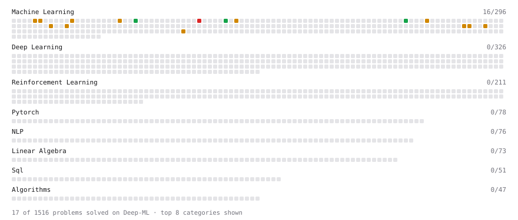

# Deep-ML

My machine learning practice from [Deep-ML](https://www.deep-ml.com). Every solution here was written by hand.

**23** solved · 16 problems · 0 labs · 7 math

[**Browse the interactive portfolio**](https://mishrayuvraj-8905.github.io/deep-ml/) to replay this filling in over time.

## Problems

| | Difficulty | Solved | |
| --- | --- | --- | --- |
| [Implement Early Stopping Based on Validation Loss](https://www.deep-ml.com/problems/135) | easy | 2026-10-03 | [solution](problems/0135-implement-early-stopping-based-on-validation-loss) |
| [Implement Gini Impurity Calculation for a Set of Classes](https://www.deep-ml.com/problems/64) | easy | 2026-10-03 | [solution](problems/0064-implement-gini-impurity-calculation-for-a-set-of-classes) |
| [Implement Weight Decay as L2 Regularization](https://www.deep-ml.com/problems/198) | easy | 2026-10-02 | [solution](problems/0198-implement-weight-decay-as-l2-regularization) |
| [Bias-Variance Decomposition from Bootstrap](https://www.deep-ml.com/problems/804) | medium | 2026-10-03 | [solution](problems/0804-bias-variance-decomposition-from-bootstrap) |
| [Calculate Explained Variance Ratio for PCA](https://www.deep-ml.com/problems/350) | medium | 2026-10-03 | [solution](problems/0350-calculate-explained-variance-ratio-for-pca) |
| [Elastic Net Regression via Gradient Descent](https://www.deep-ml.com/problems/139) | medium | 2026-10-02 | [solution](problems/0139-elastic-net-regression-via-gradient-descent) |
| [Generate Sorted Polynomial Features](https://www.deep-ml.com/problems/32) | medium | 2026-10-02 | [solution](problems/0032-generate-sorted-polynomial-features) |
| [Implement Grid Search](https://www.deep-ml.com/problems/288) | medium | 2026-10-03 | [solution](problems/0288-implement-grid-search) |
| [Implement K-Fold Cross-Validation](https://www.deep-ml.com/problems/18) | medium | 2026-10-03 | [solution](problems/0018-implement-k-fold-cross-validation) |
| [Implement Lasso Regression using ISTA](https://www.deep-ml.com/problems/50) | medium | 2026-10-02 | [solution](problems/0050-implement-lasso-regression-using-ista) |
| [Implement Stratified K-Fold Cross-Validation](https://www.deep-ml.com/problems/840) | medium | 2026-10-03 | [solution](problems/0840-implement-stratified-k-fold-cross-validation) |
| [Learning Curve Generator for Bias-Variance Diagnosis](https://www.deep-ml.com/problems/800) | medium | 2026-10-02 | [solution](problems/0800-learning-curve-generator-for-bias-variance-diagnosis) |
| [Polynomial Regression Fit](https://www.deep-ml.com/problems/801) | medium | 2026-10-02 | [solution](problems/0801-polynomial-regression-fit) |
| [Principal Component Analysis (PCA) Implementation](https://www.deep-ml.com/problems/19) | medium | 2026-10-03 | [solution](problems/0019-principal-component-analysis-pca-implementation) |
| [Reconstruction Error from PCA](https://www.deep-ml.com/problems/353) | medium | 2026-10-03 | [solution](problems/0353-reconstruction-error-from-pca) |
| [Train Softmax Regression with Gradient Descent](https://www.deep-ml.com/problems/105) | hard | 2026-10-03 | [solution](problems/0105-train-softmax-regression-with-gradient-descent) |

## Math

| | Difficulty | Solved | |
| --- | --- | --- | --- |
| [Model Selection: CV, AIC, and BIC](https://www.deep-ml.com/math-problems/43) | easy | 2026-09-22 | [solution](math/0043-model-selection-cv-aic-and-bic) |
| [Bias–Variance Decomposition](https://www.deep-ml.com/math-problems/39) | medium | 2026-09-22 | [solution](math/0039-bias-variance-decomposition) |
| [Covariance and Correlation](https://www.deep-ml.com/math-problems/17) | medium | 2026-10-01 | [solution](math/0017-covariance-and-correlation) |
| [Information Theory: Entropy](https://www.deep-ml.com/math-problems/24) | medium | 2026-10-01 | [solution](math/0024-information-theory-entropy) |
| [Optimization: Convexity and Critical Points](https://www.deep-ml.com/math-problems/6) | medium | 2026-09-22 | [solution](math/0006-optimization-convexity-and-critical-points) |
| [Eigendecomposition and SVD](https://www.deep-ml.com/math-problems/16) | hard | 2026-10-01 | [solution](math/0016-eigendecomposition-and-svd) |
| [Maximum Likelihood and MAP](https://www.deep-ml.com/math-problems/26) | hard | 2026-10-01 | [solution](math/0026-maximum-likelihood-and-map) |

---

_This file is regenerated by Deep-ML on every push._
